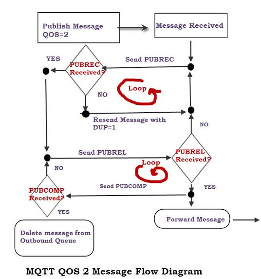
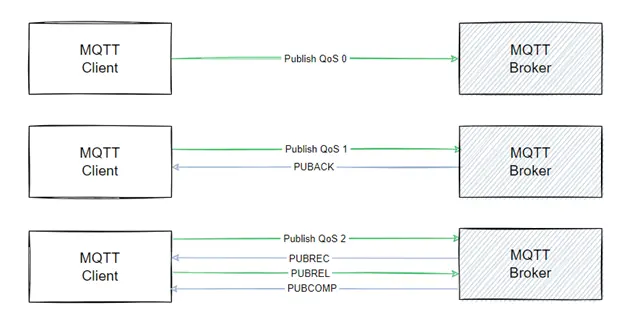
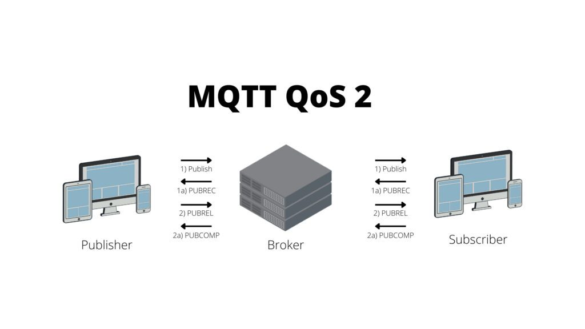

# MQTT QoS-2 Implementation on Arduino (Ultrasonic Sensor Based)


## why I did this project?
> This project was implemented as part of an academic requirement to demonstrate understanding of MQTT QoS-2 behavior on embedded systems.

## Overview


This project demonstrates a **reliable MQTT QoS-2 message delivery system** using an **Arduino Uno** connected to an **ultrasonic distance sensor**.

Instead of using a full MQTT client library on the Arduino, the project focuses on **understanding and implementing the behavior of MQTT QoS-2** in a simplified and transparent way.

The goal is **not broker optimization**, but **learning how exactly data moves, gets acknowledged, and is guaranteed to be delivered exactly once**.

---

## System Components & Roles

### 1️⃣ Arduino (Publisher Device)

**Role:**
The Arduino acts as a **sensor node + MQTT publisher**.

**What it does:**

* Measures distance using an **ultrasonic sensor**
* Converts the measurement into a data payload
* Publishes the data using **MQTT QoS-2 semantics**
* Ensures the message is delivered **exactly once**, even after power loss

**Why Arduino?**

* Resource-constrained device
* No hidden abstractions
* Forces clarity in protocol behavior

---

### 2️⃣ Ultrasonic Sensor (HC-SR04)

**Role:**
Provides real-world input data.

**Data generated:**

* Distance (in cm)
* Periodic measurements

This makes the MQTT communication **observable and meaningful**, instead of sending dummy values.

---

### 3️⃣ Laptop (Receiver / Controller)

**Role:**
Acts as:

* MQTT **subscriber**
* Debug console
* State-tracking observer

**What it does:**

* Receives sensor data published by Arduino
* Sends acknowledgments required by QoS-2
* Helps visualize message flow and retries

---

## How Data Flows in This System

### High-level flow

```
Ultrasonic Sensor
        ↓
     Arduino
        ↓   (PUBLISH - QoS 2)
     MQTT Broker
        ↓
      Laptop
```

---

### What exactly is transmitted?

| Direction | Sender  | Receiver | Data / Signal            |
| --------- | ------- | -------- | ------------------------ |
| →         | Arduino | Broker   | Distance value (payload) |
| ←         | Broker  | Arduino  | PUBREC                   |
| →         | Arduino | Broker   | PUBREL                   |
| ←         | Broker  | Arduino  | PUBCOMP                  |

This **4-step handshake** ensures **exactly-once delivery**.

---

## QoS-2: Explained Without Jargon

QoS-2 means:

> “The message will arrive **once and only once**, no matter what.”

This is achieved by:

* Splitting delivery into **phases**
* Tracking message IDs
* Never assuming success without confirmation

Even if:

* Arduino resets
* Communication breaks midway
* A message is re-sent

👉 **Duplicates are avoided**.

---

## QoS-2 State Machine (Conceptual)







**Simple interpretation:**

1. Arduino sends data → **PUBLISH**
2. Receiver says “I got it” → **PUBREC**
3. Arduino says “Please release it” → **PUBREL**
4. Receiver confirms completion → **PUBCOMP**

Only after step 4 is the message considered *fully delivered*.

---

## The Special Feature (Important Part of This Project)

### 🔐 Persistent Message State Using EEPROM

This implementation includes a **non-volatile reliability feature**.

**What problem it solves:**

* If Arduino resets **mid-QoS-2 exchange**
* Normally → message could be lost or duplicated

**What we implemented instead:**

* Message ID
* Pending state
* Sensor value

are stored in **EEPROM**.

So after reboot:

* Arduino checks EEPROM
* Detects an unfinished QoS-2 transaction
* **Resumes exactly where it left off**

✅ No data loss
✅ No duplicates
✅ True “exactly once” behavior, even across power failure

---

> tldr: this following readme content is generated using chatgpt after giving careful instructions. 

---

## References:

1. https://images.openai.com/thumbnails/url/JBA0JHicu5meUVJSUGylr5-al1xUWVCSmqJbkpRnoJdeXJJYkpmsl5yfq5-Zm5ieWmxfaAuUsXL0S7F0Tw5xdgv19fPPyQpNLswL8KoICAg0LTRNd0pLDMl1DPP2zKx0KswIdPGOLDUMVCu2NTQAAA--JRI?utm_source=chatgpt.com
2. https://blog.softwaretoolbox.com/hs-fs/hubfs/Tech_Support_Corner/2023_11_30_Exploring%20MQTT%20Quality%20of%20Service%20with%20DataHub/DataHub_2_QoS_Diagram.webp?height=328&name=DataHub_2_QoS_Diagram.webp&width=624&utm_source=chatgpt.com
3. https://cedalo.com/wp-content/uploads/2022/10/mqtt2-1024x576.jpg?utm_source=chatgpt.com

